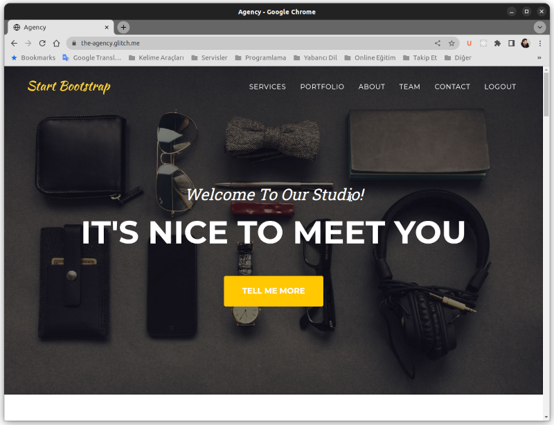
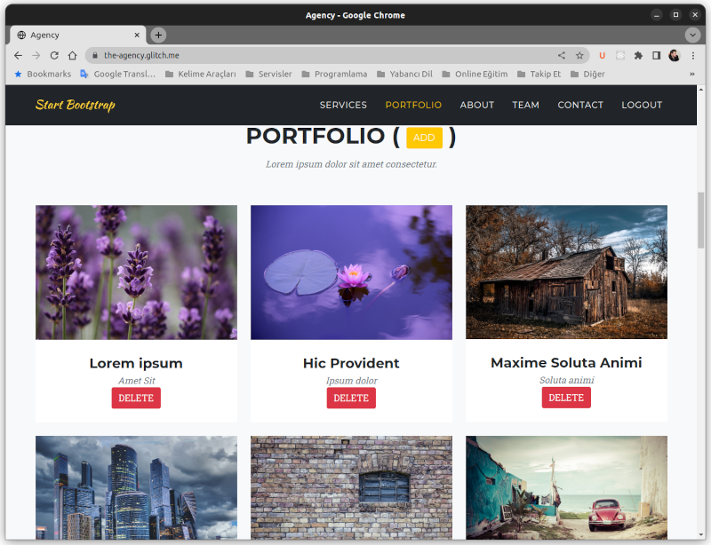
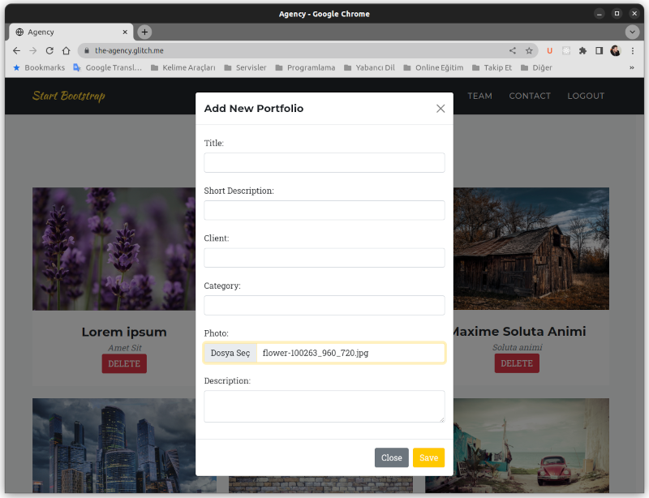
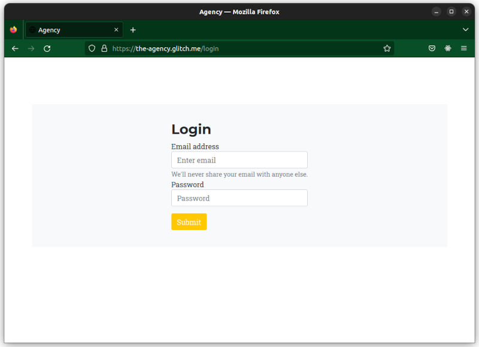

# Agency

Bir portfolio sitesi. Express JS temelli hazırlandı. Tema olarak bootstrap temelli ücretsiz [Agency](https://startbootstrap.com/theme/agency) teması kullanıldı.

Site içeriğinde portfolio bölümü dinamik bir yapıya sahip. Bu bölüm içeriği arayüz üzerinden değiştirilebiliyor.

## Demo

Uygulamanın demo sayfasına ulaşmak için [tıklayınız](https://the-agency.glitch.me/). Ücretsiz bir serviste bulunduğu için açılması biraz geç sürebilir.

## Nasıl Kurulacak?

Uygulama dosyalarını yüklediğinizde veya githup üzerinden fork ettiğinizde bu uygulamayı kullanmaya başlayabilirsiniz. SUnucunuz veya bilgisayarınıza dosyaları indirdiğinizde, hangi klasör üzerinde çalışacak ise tüm dosyaları o klasöre taşıyın.

Sonrasında terminali açın ve terminal içerisinden proje klasörünüze gelin. Ardından komut satırından

```
npm init
```

komutunu vererek uygulamanın kurulmasını sağlayabilirsiniz. Sonrasında proje dizininiz içerisinde bir adet **.env** dosyası oluşturun. Bu dosya içerisinde üç önemli bilgi bulunacak.

```
APP_MONGO_DB_NAME=
APP_MONGODB_FULL_URL=mongodb://localhost:27017
APP_SESSION_SECRET_KEY=
```

Bunlardan ilki uygulam için bir veritabanı adı olacak. İkincisi ise mongoodb için kullanıcı adı, kullanıcı şifresi de dahil olmak üzere tam mongodb url adresini girmeniz gerekiyor. Son olarak oturum için bir güvenlik anahtarı oluşturmalısınız, rastgele rakam ve sayılardan oluşan bir güvenlik kelimesi.

Eğer kendi bilgisayarınız üzerinde mongodb varsa ve kullanıcı adı ve şifre gerekmiyorsa, mongodb urlsini girebilirsiniz. Bu genellikle

```
mongodb://localhost:27017
```

şeklinde olacaktır. Örnek bir **.env** dosyası aşağıdaki gibi olabilir. Kendi ayarlarınıza göre oluşturmalısınız.

```
APP_MONGO_DB_NAME=agency-db
APP_MONGODB_FULL_URL=mongodb://localhost:27017
APP_SESSION_SECRET_KEY=fdas/fasjdfa_242UUfa222rafasd
```

Gerekli ayarlamaları yaptığınızda terminalden, yine proje klasörü içerisinde,

```
node app
```

diyerek uygulamayı başlatabilirsiniz. Uygulamayı başlattığınızda bir adet kullanıcı oluşturmanız gerekiyor. Sadece tek kullanıcıya izin veriliyor. Bunun için

```
http://localhost:5000/login
```
adresine gitmeniz gerekiyor, eğer bir hosting üzerinde işlem yapıyorsanız o zaman adresi hostinginize göre girmelisiniz. 

İlk girişte kullanıcı kayıt formunu çıkacaktır. İlk kullanıcı oluşturulduğunda login formu görüntülenir.

Kullanıcı oluşturduktan sonra artık portfolio eklemeye başlayabilirsiniz. Ekleme ve silme ana sayfa üzerinde bulunan portfolio bölümünden yapılıyor. Yeni bir sayfa oluşturulmadı.

## Kullanılan Teknolojiler

Bu uygulama geliştirilirken kullanılan teknolojiler şunlardır.

- Node JS
- Express JS
- Node fs modülü
- Bcrypt
- Connect-mongo
- dotenv
- ejs
- express-fileupload
- express-session
- express-validator
- mongoose
- bootstrap

## Ekran Görüntüleri

Uygulama ekran görüntüleri aşağıdadır.


Anasayfa


Portfolio


Add Portfolio


Login


